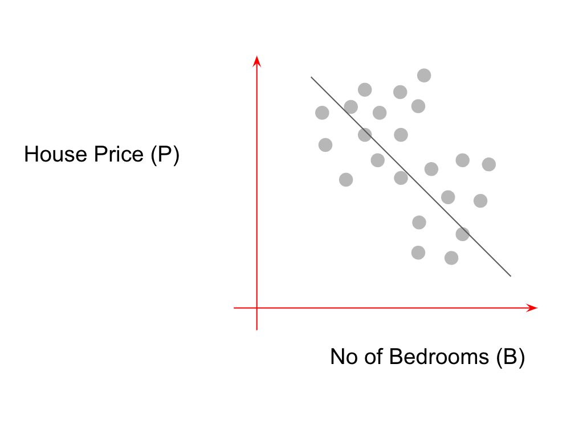

# Association != Causation

Machine Learning systems have become exceptionally good at fitting trends/associations in data.  But they are not formulated to answer “What If” questions \(What would have happened if I administered medicine B to this patient who is currently under a  medicine A regimen?\).  Therefore,  data-driven prediction models are often mistakenly used to draw causal effects, but neither the parameters involved, nor the predictions necessarily have a causal interpretation.


 Models built for prediction do not guarantee trustable decisions or interventions. 


Take this toy dataset for house price vs. number of bedrooms collected by an analyst: 

In the graphical notation \(to be introduced more formally later\), if our mental model were:

i.e. that the number of bedrooms \(B\) is the only cause of house price \(P\),  then fitting an ML model to the above data would give us a very counterintuitive result - houses get cheaper as number of bedrooms increase!

However, a correct causal 

